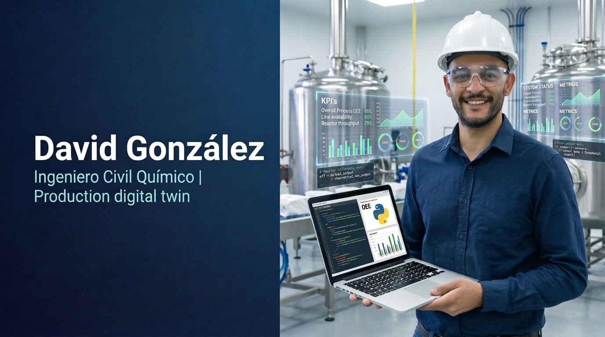
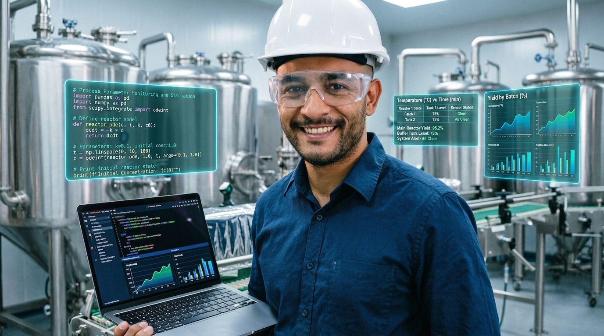

<p align="center">
  
</p>

<h1 align="center">🏭 Gemelo Digital de Producción</h1>
<h3 align="center">Simulación de eventos discretos para líneas de envasado industrial</h3>

<p align="center">
  <a href="https://github.com/icqdgonzalezs/gemelo-digital-produccion/actions"></a>
  <a href="https://www.python.org/"></a>
  <a href="https://simpy.readthedocs.io/"></a>
  <a href="https://plotly.com/"></a>
  <a href="https://pytest.org/"></a>
  <a href="LICENSE"></a>
  
</p>

<p align="center">
  <i>💡 "Simular antes de invertir: reducir riesgos, identificar cuellos de botella y predecir OEE antes de tocar una sola máquina en planta."</i>
</p>

---

## 📑 Tabla de contenidos

- [Contexto del portafolio](#-contexto-del-portafolio)
- [Problema de negocio](#-problema-de-negocio)
- [Solución](#-solución)
- [Características principales](#-características-principales)
- [KPIs y métricas](#-kpis-y-métricas)
- [Casos de uso](#-casos-de-uso)
- [Arquitectura](#-arquitectura)
- [Stack tecnológico](#-stack-tecnológico)
- [Instalación y ejecución](#-instalación-y-ejecución)
- [Configuración de línea](#-configuración-de-línea)
- [Estructura del proyecto](#-estructura-del-proyecto)
- [Roadmap](#-roadmap)
- [Autor](#-autor)

---

## 🎯 Contexto del portafolio

Este repositorio es el **Proyecto 02 — SIMULATE** dentro de mi ecosistema profesional **Industrial Operations Intelligence**:

```
              INDUSTRIAL OPERATIONS INTELLIGENCE
                           │
                           ▼
                    INDUSTRIAL DATA
                           │
          ┌────────────────┼────────────────┐
          ▼                ▼                ▼
       ANALYZE          SIMULATE         MONITOR
          │                │                │
          └────────────────┼────────────────┘
                           ▼
                        PREDICT
                           │
                           ▼
                       OPTIMIZE
                           │
                           ▼
                        DECIDE
```

- 📊 **Proyecto 01** → *Inteligencia de KPI industriales* (¿Qué está ocurriendo?)
- 🏭 **Proyecto 02** → *Gemelo digital de producción* (¿Qué podría ocurrir?) ← **este repositorio**
- 🔧 **Proyecto 03** → *Mantenimiento predictivo* (¿Qué podría fallar?)
- ⚙️ **Proyecto 04** → *Optimizador de procesos* (¿Cuál es la mejor alternativa?)
- 🤖 **Proyecto 05** → *Copiloto de IA industrial* (¿Qué debería decidir?)

---

## 💼 Problema de negocio

Las plantas de envasado de alimentos sólidos enfrentan decisiones costosas **sin datos confiables**:

- ❌ ¿Podemos aumentar la producción sin nuevas inversiones?
- ❌ ¿Cuál estación es el verdadero cuello de botella?
- ❌ ¿Cuánta variabilidad puede tolerar el proceso antes de perder calidad?
- ❌ ¿Vale la pena agregar un buffer intermedio?
- ❌ ¿Qué OEE real podemos esperar bajo condiciones reales de falla?

**Tomar estas decisiones basándose en intuición puede costar millones.**

---

## ✅ Solución

Un **gemelo digital** de la línea de producción que simula cada evento (llegada de producto, ciclos, fallas, reparaciones, calidad) bajo escenarios controlados mediante **Monte Carlo**. Permite:

- ✅ **Predecir** OEE, producción y utilización antes de implementar cambios
- ✅ **Identificar** cuellos de botella mediante puntuación compuesta
- ✅ **Cuantificar** la variabilidad con intervalos de confianza
- ✅ **Evaluar** escenarios alternativos sin detener la planta
- ✅ **Generar** reportes ejecutivos profesionales (HTML/PNG/Excel)

---

## ✨ Características principales

- 🎯 **Motor de simulación discreta** basado en `SimPy` (eventos reales de planta)
- 🎲 **Análisis Monte Carlo** con semillas deterministas → resultados reproducibles
- 📊 **Dashboard Plotly interactivo**: OEE, diagramas de violín, mapas de calor, balance de tiempos
- ⚠️ **Detección de cuellos de botella** por utilización, rendimiento y score compuesto
- 📈 **Índices Cp/Cpk** para evaluar capacidad de proceso según Six Sigma
- 🛠️ **Configuración flexible** vía YAML (sin tocar una línea de código)
- 📄 **Reportes automáticos** en HTML interactivo, PNG ejecutivo y Excel multihoja
- 💻 **CLI profesional** con `rich` (consola con colores y barras de progreso)
- 🧪 **+20 pruebas unitarias** con `pytest` para garantizar robustez

---

## 📈 KPIs y métricas

| Métrica | Descripción | Estándar |
|---------|-------------|----------|
| **OEE** | Disponibilidad × Rendimiento × Calidad | ISO 22400 |
| **Cuello de botella** | Estación con mayor utilización / menor rendimiento | Análisis multicriterio |
| **Cp / Cpk** | Capacidad del proceso de tiempos de ciclo | Six Sigma |
| **MTBF / MTTR** | Tiempo medio entre fallas / tiempo medio de reparación | IEC 60050 |
| **Producción por réplica** | Unidades producidas en cada ejecución Monte Carlo | — |
| **Intervalos de confianza** | Rango estadístico del OEE al 95% | — |

---

## 🎯 Casos de uso

### 🏭 Caso 1: Evaluación de capacidad instalada
> *"¿Podemos cumplir con la demanda de 10,000 unidades/día sin inversión?"*

Se simulan 100 réplicas del turno y se evalúa la producción total vs. demanda objetivo.

### 💰 Caso 2: Análisis de inversión (CAPEX)
> *"¿Vale la pena agregar una segunda llenadora?"*

Se compara OEE, producción y ROI del escenario actual vs. el escenario con inversión.

### 🔧 Caso 3: Optimización de mantenimiento
> *"¿Mejoramos MTBF o reducimos MTTR?"*

Se simulan ambos escenarios para encontrar el balance óptimo entre costo y disponibilidad.

### 📦 Caso 4: Dimensionamiento de buffers
> *"¿Qué capacidad de buffer intermedio necesitamos?"*

Se varía el tamaño del buffer y se analiza el impacto en WIP y throughput.

---

## 🏗️ Arquitectura

```
┌──────────────────────────────────────────────────────────────┐
│                      CLI (main.py)                            │
│                    --replications --config                    │
└────────────────────┬─────────────────────────────────────────┘
                     │
                     ▼
┌──────────────────────────────────────────────────────────────┐
│              config_loader.py  (PyYAML)                       │
│     Lee line_config.yaml → objetos StationConfig              │
└────────────────────┬─────────────────────────────────────────┘
                     │
                     ▼
┌──────────────────────────────────────────────────────────────┐
│              simulator.py  (SimPy + Monte Carlo)              │
│  ┌────────────┐  ┌────────────┐  ┌────────────┐              │
│  │ Estación 1 │→ │ Estación 2 │→ │ Estación N │              │
│  │ (buffer)   │  │ (buffer)   │  │ (buffer)   │              │
│  └────────────┘  └────────────┘  └────────────┘              │
└────────────────────┬─────────────────────────────────────────┘
                     │
                     ▼
┌──────────────────────────────────────────────────────────────┐
│       oee.py    +    bottleneck.py    +    models.py          │
│  Cálculo OEE, Cp/Cpk, MTBF/MTTR, detección de cuellos        │
└────────────────────┬─────────────────────────────────────────┘
                     │
                     ▼
┌──────────────────────────────────────────────────────────────┐
│                reporter.py  (Plotly + OpenPyXL)               │
│   Dashboard HTML  ·  Summary PNG  ·  Reporte Excel XLSX       │
└──────────────────────────────────────────────────────────────┘
```

---

## 🛠️ Stack tecnológico

| Categoría | Herramienta | Uso |
|-----------|-------------|-----|
| **Lenguaje** | Python 3.9+ | Base del proyecto |
| **Simulación** | SimPy 4.1 | Motor de eventos discretos |
| **Numérico** | NumPy, SciPy | Cálculos y estadística |
| **Datos** | Pandas | Análisis de resultados |
| **Visualización** | Plotly, Matplotlib | Dashboard HTML + PNG |
| **Reportes** | OpenPyXL | Excel multihoja |
| **Configuración** | PyYAML | Parámetros de línea |
| **CLI** | Rich, argparse | Consola profesional |
| **Testing** | Pytest, pytest-cov | +20 pruebas unitarias |

---

## 🚀 Instalación y ejecución

### Opción 1: Instalación tradicional

```bash
# 1. Clonar el repositorio
git clone https://github.com/icqdgonzalezs/gemelo-digital-produccion.git
cd gemelo-digital-produccion

# 2. Crear entorno virtual
python3 -m venv venv
source venv/bin/activate   # Windows: venv\Scripts\activate

# 3. Instalar dependencias
pip install -r requirements.txt

# 4. Ejecutar simulación
python main.py
```

### Opción 2: Ejecución rápida (5 réplicas de prueba)

```bash
python main.py --replications 5 --config config/line_config.yaml
```

### Opciones avanzadas

```bash
python main.py \
    --replications 100 \
    --config config/line_config.yaml \
    --seed 42 \
    --no-dashboard
```

### Ejecutar pruebas

```bash
pytest tests/ -v --cov=src
```

---

## ⚙️ Configuración de línea

El comportamiento de la línea se define en `config/line_config.yaml` (sin tocar código):

```yaml
stations:
  - id: S01
    name: "Llenadora"
    rate_upm: 95.0            # unidades/minuto
    cycle_time_std: 0.05      # variabilidad ±5%
    mtbf_min: 120             # tiempo medio entre fallas
    mttr_min: 8               # tiempo medio reparación
    quality_rate: 0.998       # 99.8% conformes

  - id: S02
    name: "Selladora"
    rate_upm: 88.0
    cycle_time_std: 0.07
    mtbf_min: 90
    mttr_min: 12
    quality_rate: 0.995

  # ... agregar más estaciones

simulation:
  duration_min: 480           # duración del turno (minutos)
  buffer_capacity: 20         # capacidad del buffer entre estaciones
  warmup_min: 30              # período de calentamiento
```

---

## 📁 Estructura del proyecto

```
gemelo-digital-produccion/
├── config/
│   └── line_config.yaml           # Parámetros editables
├── data/                          # Datos de entrada (opcional)
├── src/
│   ├── simulator.py               # Motor SimPy + Monte Carlo
│   ├── oee.py                     # Cálculo de OEE y estadísticas
│   ├── bottleneck.py              # Detección de cuellos y Cp/Cpk
│   ├── reporter.py                # Dashboard Plotly + PNG + Excel
│   ├── models.py                  # Dataclasses
│   └── config_loader.py           # Carga y validación de YAML
├── tests/
│   └── test_simulator.py          # Suite de pruebas unitarias
├── reports/                       # Salidas generadas
│   ├── dashboard.html             # Dashboard interactivo
│   ├── summary.png                # Resumen ejecutivo
│   └── report.xlsx                # Reporte multihoja
├── capturas/                      # Imágenes para README
├── main.py                        # CLI principal
├── requirements.txt
├── .gitignore
├── LICENSE
└── README.md
```

---

## 🗺️ Roadmap

- [x] Motor de simulación con SimPy
- [x] Cálculo de OEE según ISO 22400
- [x] Detección de cuellos de botella
- [x] Análisis Monte Carlo
- [x] Dashboard HTML interactivo
- [x] Suite de pruebas unitarias (+20 tests)
- [ ] 🚧 Interfaz web con Streamlit
- [ ] 🚧 API REST para consultas de simulación
- [ ] Integración con bases de datos reales de producción
- [ ] Modelado de consumo energético
- [ ] Análisis de costos operativos (OPEX)
- [ ] Exportación nativa a Power BI

---

## 📜 Licencia

Distribuido bajo la licencia MIT. Ver [`LICENSE`](LICENSE) para más información.

---

## 👤 Autor

<p align="center">
  
</p>

<p align="center">
  <strong>David González</strong><br/>
  <em>Ingeniero Civil Químico · Data Analytics · Mejora Continua</em>
</p>

<p align="center">
  <a href="https://linkedin.com/in/davidgonzalezsz"></a>
  <a href="https://github.com/icqdgonzalezs"></a>
  <a href="mailto:icq.dgonzalezs@gmail.com"></a>
</p>

---

<p align="center">
  <i>🏭 Parte del portafolio <strong>Industrial Operations Intelligence</strong><br/>
  Analizar → Simular → Predecir → Optimizar → Decidir</i>
</p>
