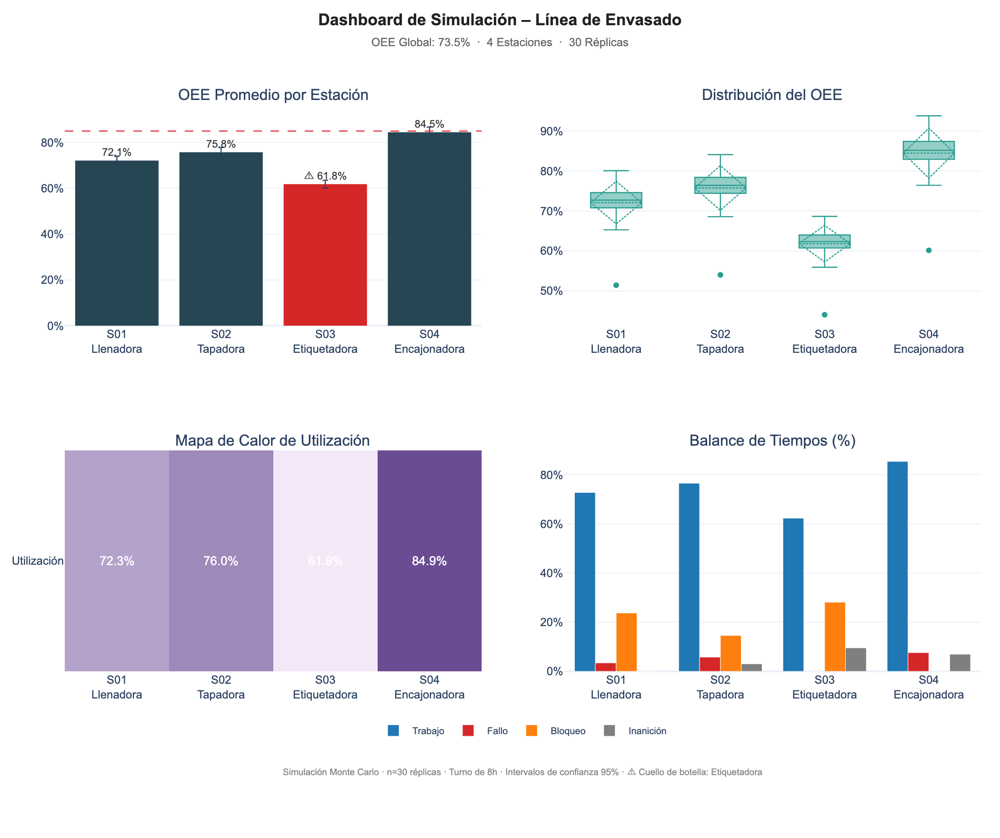
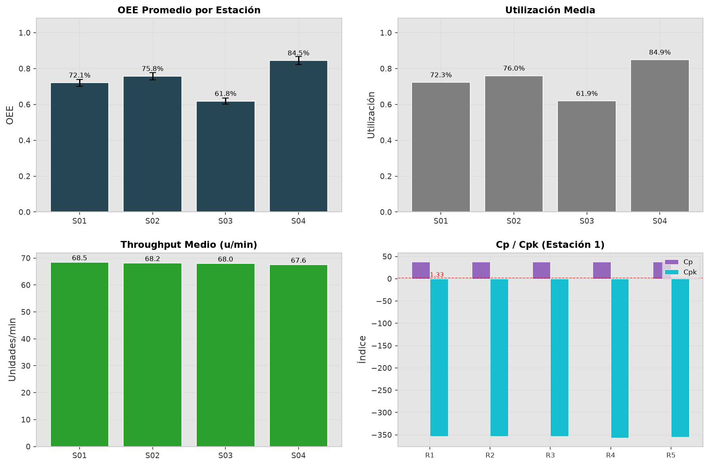

# 🏭 Production Line Simulator

[](https://www.python.org/)
[](https://simpy.readthedocs.io/)
[](LICENSE)

Simulador de eventos discretos para líneas de envasado de alimentos sólidos. Calcula **OEE** (ISO 22400), detecta **cuellos de botella**, aplica **Monte Carlo** y genera dashboards interactivos en HTML/PNG/Excel.

---

## 📌 Descripción general

- **Simulación realista** de líneas de producción con fallas (MTBF/MTTR), buffers finitos y variabilidad.
- **Análisis de OEE** (Disponibilidad × Rendimiento × Calidad) con intervalos de confianza Monte Carlo.
- **Detección de cuellos de botella** por utilización, rendimiento y puntuación compuesta.
- **Índices Cp/Cpk** para evaluar capacidad de proceso.
- **Salidas profesionales**: dashboard HTML interactivo, resumen en PNG, Excel multihoja.

---

## ✨ Características principales

- **Motor de simulación discreta** con `SimPy`.
- **Configuración flexible** mediante archivo YAML (sin tocar código).
- **Análisis Monte Carlo** con semillas deterministas.
- **Dashboard Plotly** interactivo (OEE, violines, mapa de calor, balance de tiempos).
- **Reportes automáticos** en PNG y Excel.
- **CLI profesional** con `rich` para consola.
- **Más de 20 pruebas unitarias** con `pytest`.

---

## 📈 KPIs y métricas

| Métrica | Descripción |
|---------|-------------|
| **OEE** | Disponibilidad (A) × Rendimiento (P) × Calidad (Q) según ISO 22400 |
| **Cuello de botella** | Estación con mayor utilización / menor rendimiento |
| **Cp / Cpk** | Capacidad de proceso de tiempos de ciclo |
| **MTBF / MTTR** | Tiempo medio entre fallas y reparación |
| **Producción por réplica** | Unidades producidas en cada ejecución Monte Carlo |

---

## 🛠️ Stack tecnológico

| Herramienta | Uso |
|-------------|-----|
| **Python 3.9+** | Lenguaje base |
| **SimPy 4.1** | Motor de simulación de eventos discretos |
| **NumPy / SciPy** | Cálculos numéricos y estadística |
| **Pandas** | Análisis de resultados |
| **Plotly** | Dashboard HTML interactivo |
| **Matplotlib** | Figuras estáticas (PNG) |
| **OpenPyXL** | Reportes Excel multihoja |
| **PyYAML** | Configuración de líneas |
| **Rich** | Salida de consola mejorada |
| **Pytest** | Pruebas unitarias |

---

## 📸 Capturas del panel

**Dashboard interactivo (HTML)**


**Resumen ejecutivo (PNG)**


---

## ⚙️ Instalación y ejecución rápida

```bash
# Clonar repositorio
git clone https://github.com/icqdgonzalezs/production-line-simulation.git
cd production-line-simulation

# Crear entorno virtual
python3 -m venv venv
source venv/bin/activate   # Windows: venv\Scripts\activate

# Instalar dependencias
pip install -r requirements.txt

# Ejecutar simulación (con dashboard HTML)
python main.py

# Opciones avanzadas
python main.py --replications 50 --config config/line_config.yaml --no-dashboard
```

---

## 📁 Estructura del proyecto
```
production-line-simulation/
├── config/
│   └── line_config.yaml           # Parámetros de la línea (editable)
├── data/                          # Datos de entrada (opcional)
├── src/
│   ├── simulator.py               # Motor SimPy + Monte Carlo
│   ├── oee.py                     # Cálculo de OEE y estadísticas
│   ├── bottleneck.py              # Detección de cuellos de botella y Cp/Cpk
│   ├── reporter.py                # Dashboard Plotly + PNG + Excel
│   ├── models.py                  # Dataclasses
│   └── config_loader.py           # Carga de YAML
├── tests/
│   └── test_simulator.py          # Pruebas unitarias
├── reports/                       # Salidas generadas (HTML, PNG, XLSX)
├── main.py                        # CLI principal
├── requirements.txt
├── .gitignore
└── README.md
```

---

## ⚙️ Configuración de línea (ejemplo YAML)

```yaml
stations:
  - id: S01
    name: "Llenadora"
    rate_upm: 95.0            # unidades/minuto
    cycle_time_std: 0.05      # variabilidad ±5%
    mtbf_min: 120             # tiempo medio entre fallas
    mttr_min: 8               # tiempo medio reparación
    quality_rate: 0.998       # 99.8% conformes
  # ... agregar más estaciones
```

  ---

  ## 👤 Autor

**David González** – Ingeniero Civil Químico | Data Analytics | Mejora Continua  

[](https://linkedin.com/in/davidgonzalezsz)
[](https://github.com/icqdgonzalezs)
[](mailto:icq.dgonzalezs@gmail.com)

---

*Proyecto desarrollado como parte del portafolio profesional en simulación de procesos industriales.*
